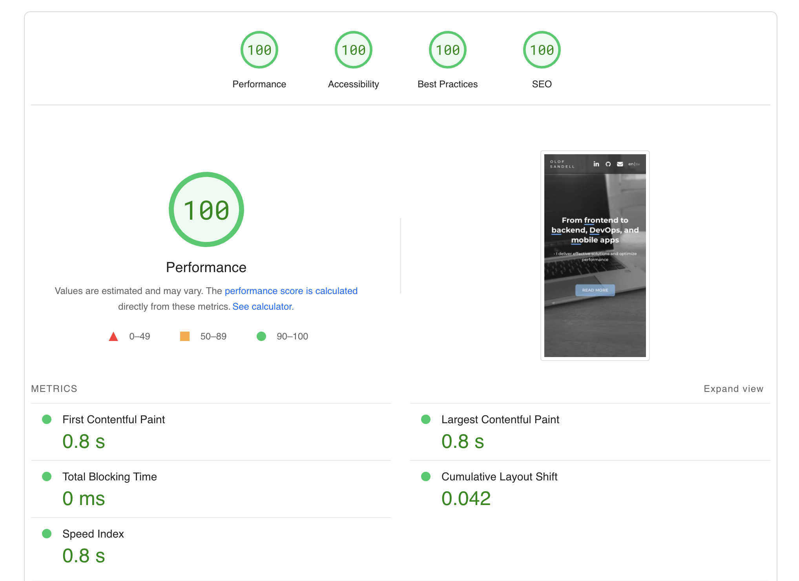

# [OlofSandell.com](https://olofsandell.com/)



## Overview

Welcome to the repository for OlofSandell.com. This project is built using Qwik framework and Tailwind CSS to achieve both optimal performance and an efficient development workflow.

## PageSpeed Insight Score

OlofSandell.com is designed with performance at its core, achieving a perfect score on Google's PageSpeed Insights. Below is a breakdown of the key metrics that contribute to this achievement:

### First Contentful Paint (FCP): 0.8s
FCP measures the time it takes for the first piece of content to be painted on the screen. A lower FCP time contributes to a better perceived loading speed from the user's perspective. At 0.8 seconds, the website provides an excellent initial loading experience.

### Largest Contentful Paint (LCP): 0.8s
LCP indicates the point in the page load timeline when the page's main content has likely loaded. A low LCP ensures that the page is useful for users as quickly as possible. Our LCP score of 0.8s means the most meaningful content loads incredibly fast, enhancing user experience.

### Total Blocking Time (TBT): 0ms
TBT measures the total amount of time when the main thread was blocked for long enough to prevent input responsiveness. A TBT of 0ms indicates that the website remains interactive and responsive to user inputs throughout its load time, which is optimal for user engagement.

### Cumulative Layout Shift (CLS): 0.042
CLS quantifies how much elements within the viewport move during page load. A low CLS ensures that the page is stable and that elements don't shift unexpectedly, which can be distracting or disruptive to the user. With a score of 0.042, the website ensures a stable visual experience.

### Speed Index: 0.8s
Speed Index measures how quickly content is visually displayed during the loading of a page. A lower Speed Index indicates that users will see the majority of the page's content sooner. At 0.8s, the site performs exceptionally well, making the content quickly visible to the users.

These metrics collectively contribute to the perfect PageSpeed Insights score, signifying a highly optimized site. This leads to an enhanced user experience and also boosts the site's SEO rankings.


## Technologies

- **Qwik**: For fast pre-rendering and optimized loading strategies.
- **Tailwind CSS**: For utility-first, highly efficient styling.

## Development Setup

### Prerequisites

- Node.js
- Yarn or npm

### Installation

```bash
# Clone the repository
git clone https://github.com/yourusername/olofsandell.com.git

# Navigate into the directory
cd olofsandell.com

# Install dependencies
yarn install

## Running the Development Server
yarn dev
```

This will start the development server, and you can navigate to http://localhost:5173 to see the application.


## Connect

For any queries or discussions, reach out to me on [LinkedIn](https://www.linkedin.com/in/olof-sandell/).

---
